3. Membuat project

    Menyalin & Menempelkan aplikasi awal

    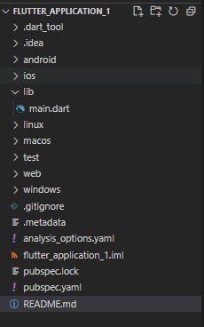

    Ganti konten file ini dengan kode berikut:

    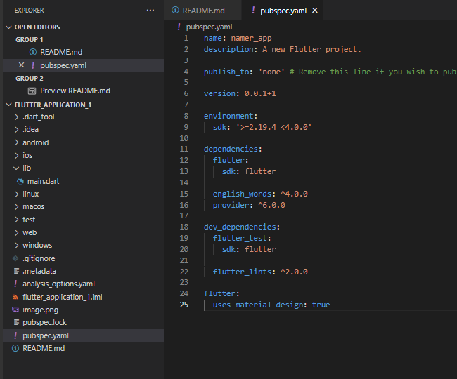

    Berikutnya, buka file konfigurasi lainnya dalam proyek tersebut, analysis_options.yaml.Ganti konten file ini dengan kode berikut:

    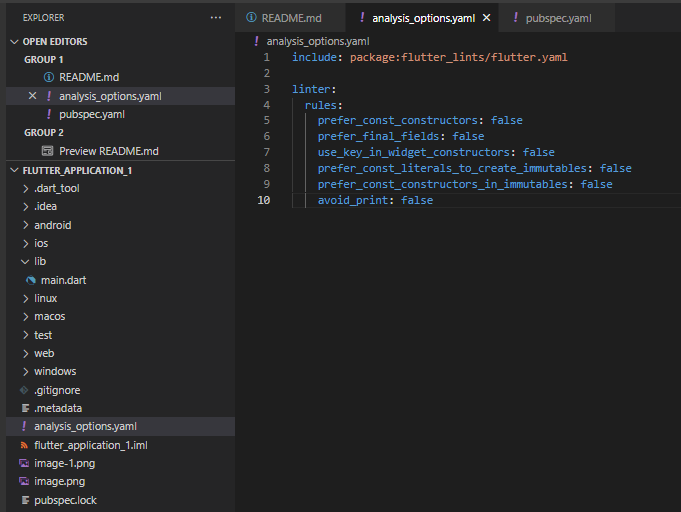

    Terakhir, buka file main.dart pada direktori lib/.Ganti konten file ini dengan kode berikut:

    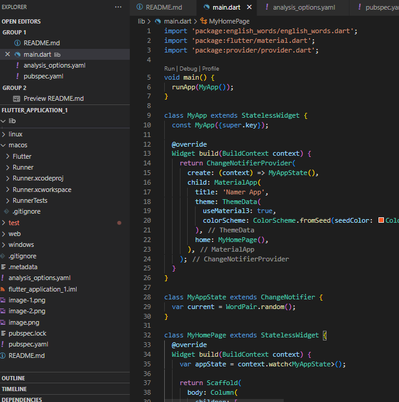

    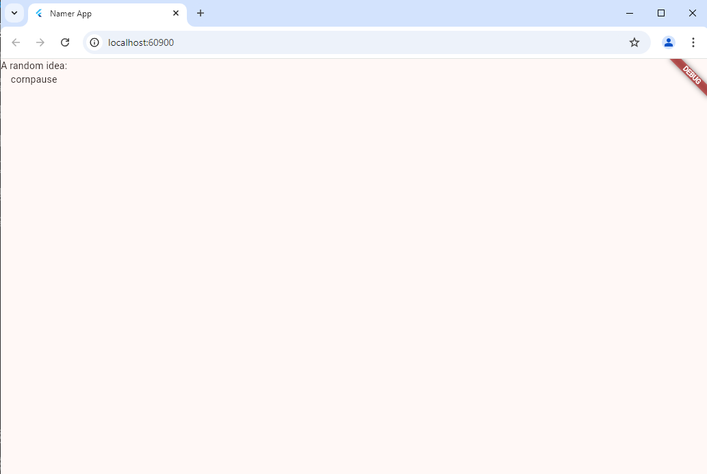

4. Menambahkan tombol
    Hot Reload Pertama

    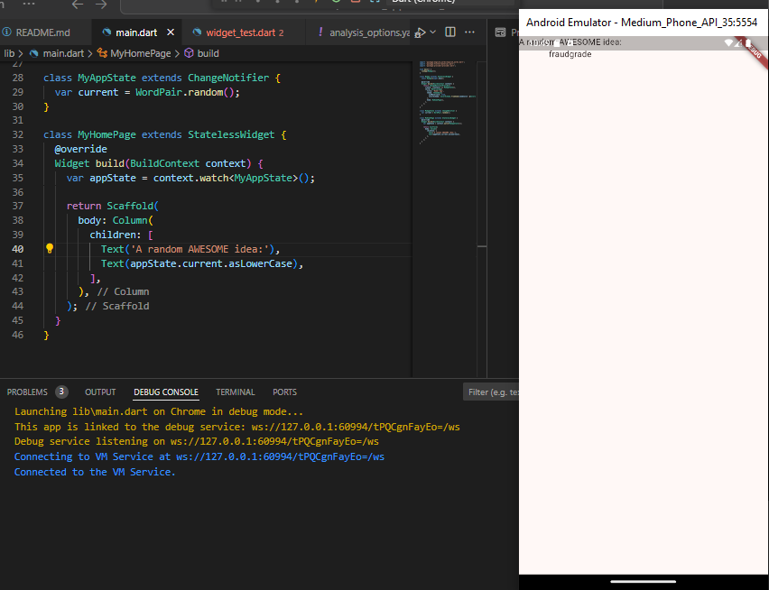

    Menambahkan tombol
     
    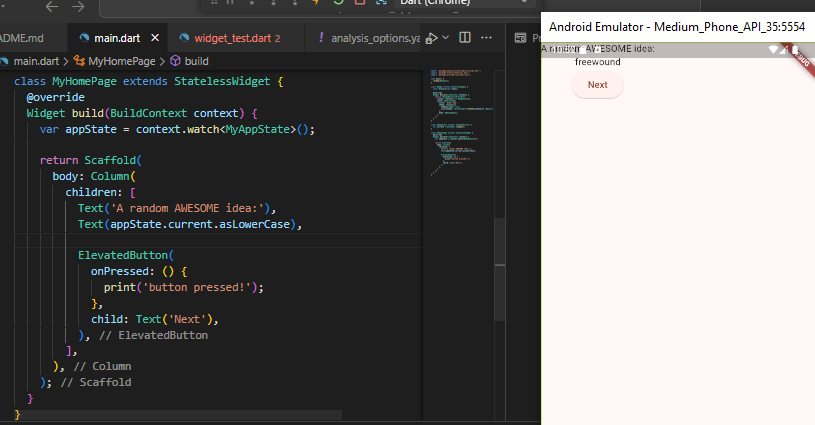

    Kursus singkat Flutter 5 menit

    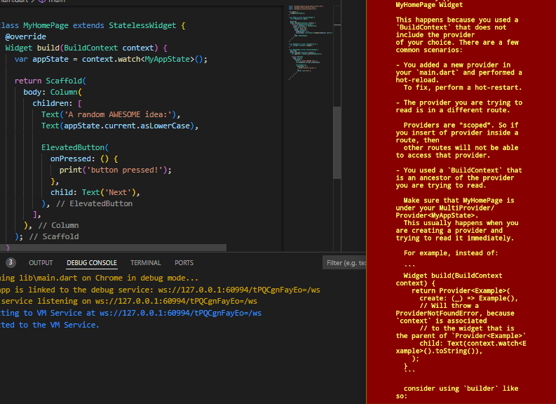

    Perilaku pertama Anda

    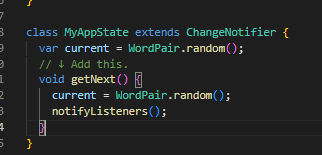

    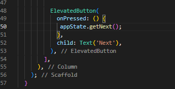

    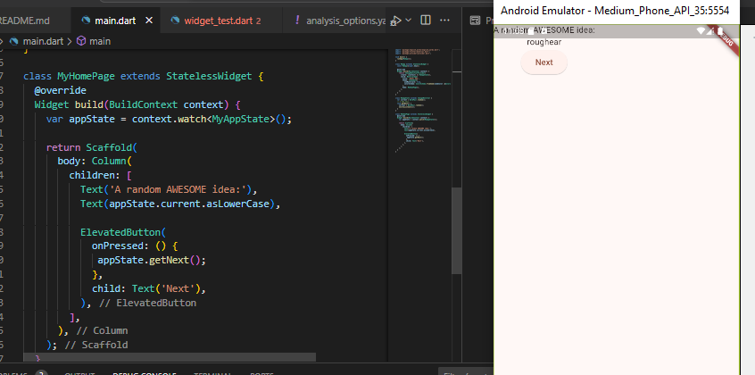

    Ketika di next

    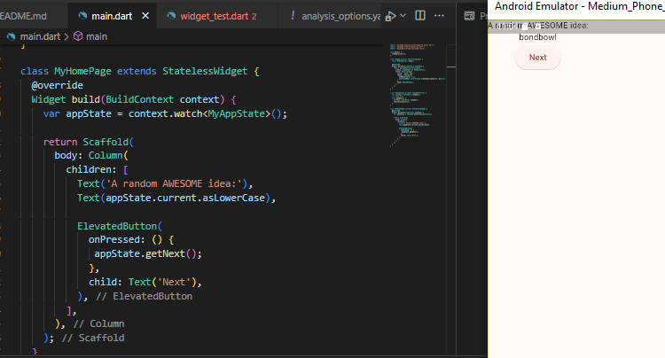

 5. Memperindah tampilan aplikasi
    
    Mengekstrak widget

    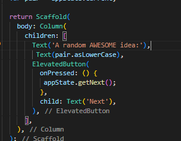

    Tema dan gaya

    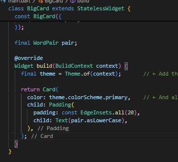

    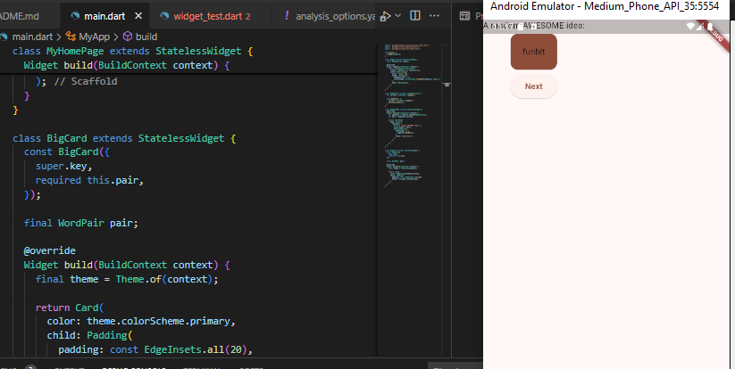

    Next Theme

    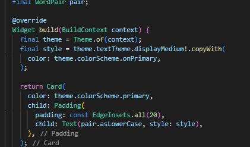

    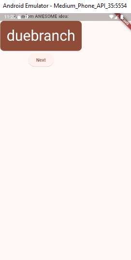

    Meningkatkan aksesibilitas

    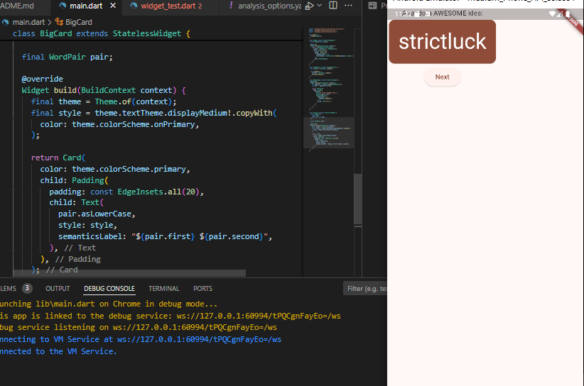

    Menempatkan UI di tengah

    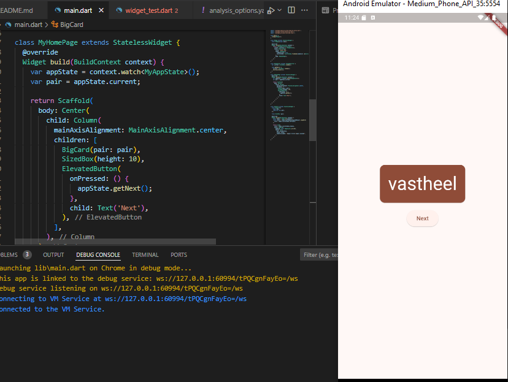

6. Menambahkan fungsi

    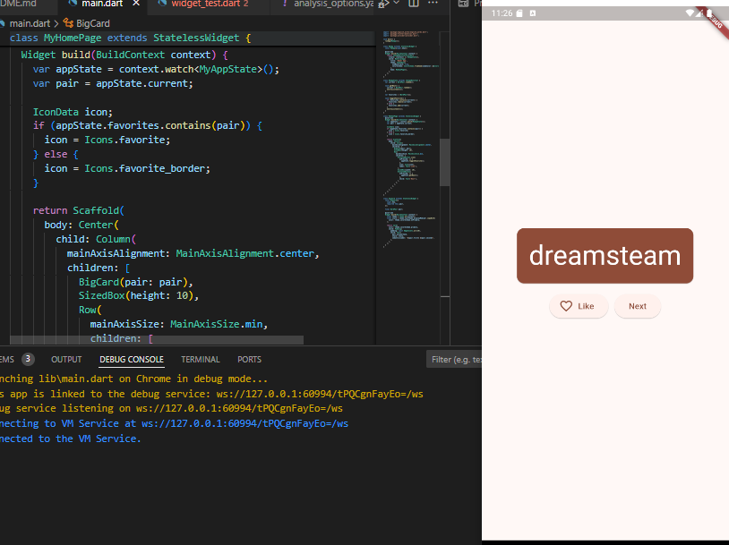

7. Menambahkan kolom samping navigasi

    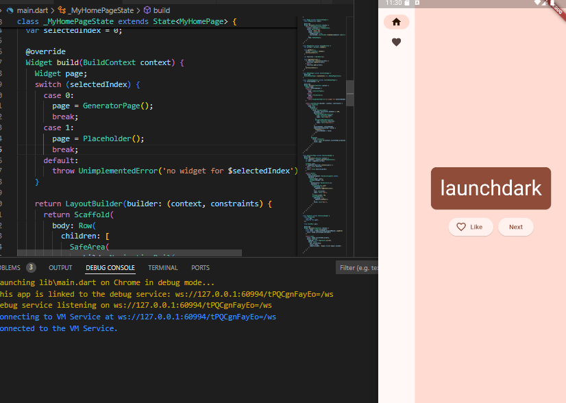

8. Menambahkan halaman baru

    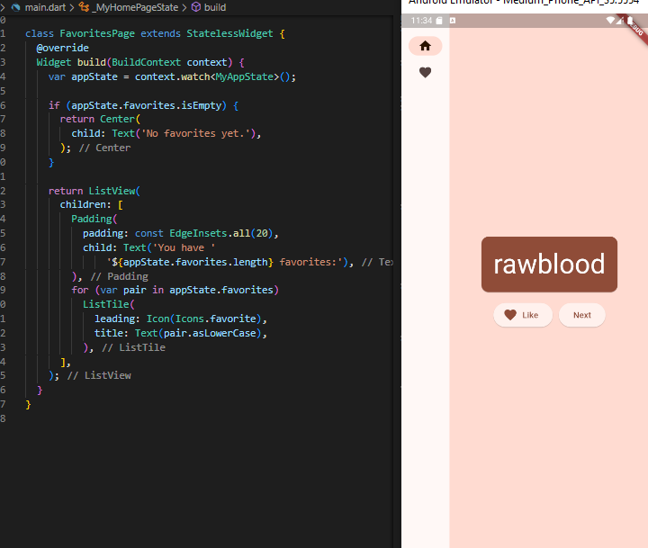
    

