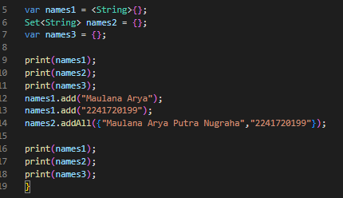
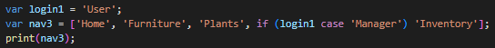

2. Praktikum 1: Eksperimen Tipe Data List
- Langkah 1:

- Langkah 2:

    Silakan coba eksekusi (Run) kode pada langkah 1 tersebut. Apa yang terjadi? Jelaskan!

    - Pada kode diatas menginisialisasi sebuah list dengan 3 angka didalamnya namun pada list index pertama dimulai dengan index ke 0. Lalu setelah menginisialisasi kode diatas melakukan beberapa pengecekan dan perubahan. Pertama, dicek apakah panjang list adalah 3 dan apakah index kedua adalah 2 menggunakan assert. Setelah itu panjang list dan index kedua dicetak. Kemudian, index kedua dalam list diubah menjadi 1, dilakukan pengecekan lagi dengan assert, dan elemen kedua dicetak ulang.
- Langkah 3:

    Ubah kode pada langkah 1 menjadi variabel final yang mempunyai index = 5 dengan default value = null. Isilah nama dan NIM Anda pada elemen index ke-1 dan ke-2. Lalu print dan capture hasilnya.

    
    

3. Praktikum 2: Eksperimen Tipe Data Set
- Langkah 1:
 
 - Langkah 2:

    Silakan coba eksekusi (Run) kode pada langkah 1 tersebut. Apa yang terjadi? Jelaskan! Lalu perbaiki jika terjadi error.

    - Kode diatas merupakan inisialisasi pada variabel halogens yang berisi 5 nama lalu variabel tersebut di print semua isinya
- Langkah 3:

Apa yang terjadi ? Jika terjadi error, silakan perbaiki namun tetap menggunakan ketiga variabel tersebut. Tambahkan elemen nama dan NIM Anda pada kedua variabel Set tersebut dengan dua fungsi berbeda yaitu .add() dan .addAll().

4. Praktikum 3: Eksperimen Tipe Data Maps
- Langkah 1:

- Langkah 2:

    Silakan coba eksekusi (Run) kode pada langkah 1 tersebut. Apa yang terjadi? Jelaskan! Lalu perbaiki jika terjadi error.

    - Kodingan tersebut membuat dua variabel, gifts dan nobleGases. Pada gifts, key bertipe data string, dan nilai bisa mengggunakan string atau angka. Pada nobleGases, kunci berupa angka, dan nilai bisa menggunakan string atau angka. Keduanya kemudian dicetak semua isinya menggunakan print().
- Langkah 3:

Apa yang terjadi ? Jika terjadi error, silakan perbaiki.

Tambahkan elemen nama dan NIM Anda pada tiap variabel di atas (gifts, nobleGases, mhs1, dan mhs2). Dokumentasikan hasilnya dan buat laporannya!

5. Praktikum 4: Eksperimen Tipe Data List: Spread dan Control-flow Operators

- Langkah 1:

- Langkah 2:

    Silakan coba eksekusi (Run) kode pada langkah 1 tersebut. Apa yang terjadi? Jelaskan! Lalu perbaiki jika terjadi error.
    - Kodingan tersebut membuat variabel list dan list2. list berisi angka 1, 2, dan 3. list2 adalah daftar baru yang dimulai dengan angka 0, diikuti oleh elemen-elemen dari list menggunakan operator penyebaran (...). Setelah itu, list1 dicetak, diikuti oleh list2, dan panjang list2 juga dicetak. Namun, ada kesalahan pada print(list1) yang seharusnya print(list); jika tidak diperbaiki, akan menghasilkan kesalahan karena list1 tidak dideklarasikan.
- Langkah 3:

Apa yang terjadi ? Jika terjadi error, silakan perbaiki.

Tambahkan variabel list berisi NIM Anda menggunakan Spread Operators. Dokumentasikan hasilnya dan buat laporannya!

- Langkah 4:

Apa yang terjadi ? Jika terjadi error, silakan perbaiki. Tunjukkan hasilnya jika variabel promoActive ketika true dan false.
 
 Ketika true

ketika false

- Langkah 5:

Apa yang terjadi ? Jika terjadi error, silakan perbaiki. Tunjukkan hasilnya jika variabel login mempunyai kondisi lain.

- Langkah 6:

Apa yang terjadi ? Jika terjadi error, silakan perbaiki. Jelaskan manfaat Collection For dan dokumentasikan hasilnya.
    
    - Manfaat dari Collection For adalah untuk menyederhanakan kode dengan membuatnya lebih terstruktur dan mudah dibaca serta menyertakan value yang dihasilkan dari iterasi langsung dalam proses pembuatan list, tanpa perlu menulis loop terpisah

    

6. Praktikum 5: Eksperimen Tipe Data Records
- Langkah 1:

- Langkah 2:

    Silakan coba eksekusi (Run) kode pada langkah 1 tersebut. Apa yang terjadi? Jelaskan! Lalu perbaiki jika terjadi error.
    - Pada kodingan diatas terdapat variabel record dimana variabel tersebut bisa menampung 2 jenis tipe data yaitu tipe data list/set dan tipe data map,lalu printnya sesuai dengan urutan tipe datanya 

- Langkah 3:

Apa yang terjadi ? Jika terjadi error, silakan perbaiki. Gunakan fungsi tukar() di dalam main() sehingga tampak jelas proses pertukaran value field di dalam Records.

- Langkah 4:

    
    
apa yang terjadi ? Jika terjadi error, silakan perbaiki. Inisialisasi field nama dan NIM Anda pada variabel record mahasiswa di atas. Dokumentasikan hasilnya dan buat laporannya!

- Langkah 5:

Apa yang terjadi ? Jika terjadi error, silakan perbaiki. Gantilah salah satu isi record dengan nama dan NIM Anda, lalu dokumentasikan hasilnya dan buat laporannya!

 